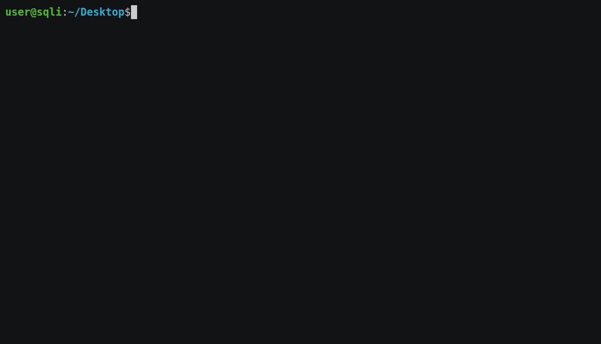
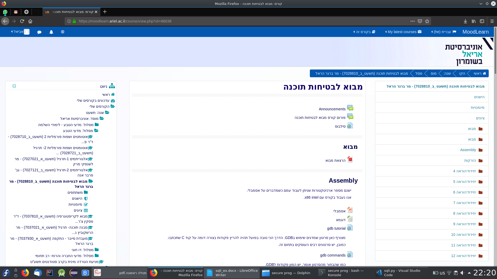
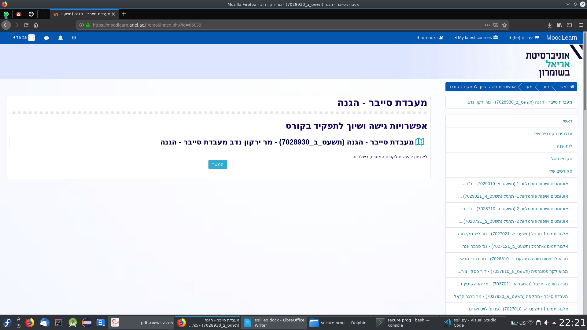
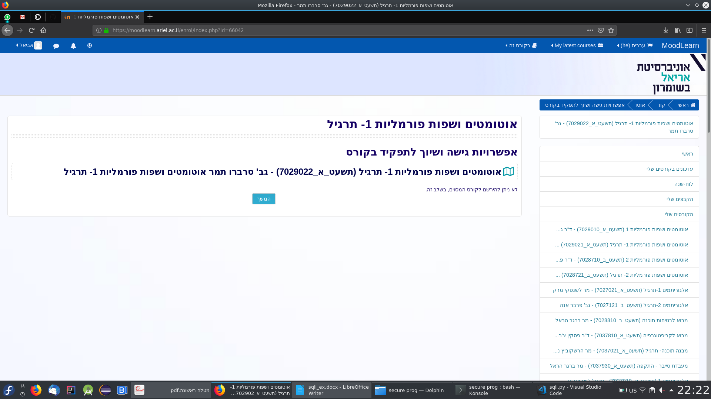
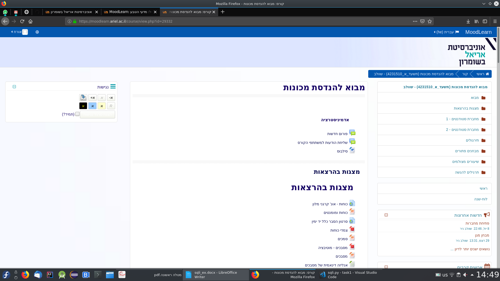
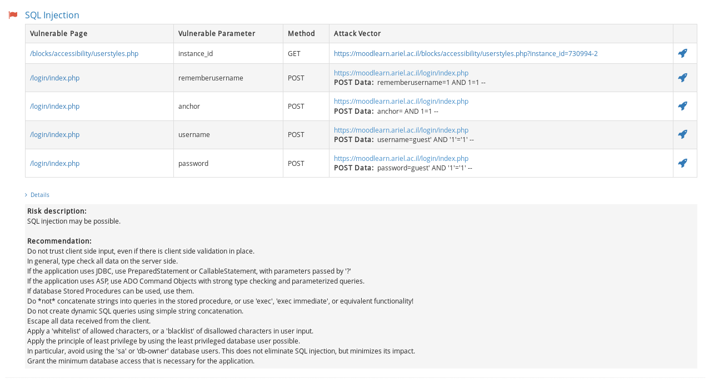

# SQLi Lab

## Installation

`pip install git+https://github.com/Avielyo10/sqli`  

## Usage

Run `sqli [options ...]`.  

Options:

* `-w` to get a summary on stdout in addition to `output.out`.
* `-t` to run the test case before running the program.

## Screenshots  

In this part I just changed the `php?id=<some_number>` to jump to another course.  
Here I tried consecutive numbers from the page I started from.

---
An example of a page with access as a guest.

---

## Q3

The weakness here is that the `.php` is visible, to solve this issue see: [StackOverflow - How to hide .php from address bar?](https://stackoverflow.com/questions/5831683/how-to-hide-php-from-address-bar).

---

## Q4

Here you can find the [output](output.out) file contains all the open pages on our moodle.
What I did to improve the efficiency is to iterate all the categories with all the possible courses, to achieve that I chose this prefix `&browse=courses&perpage=10000&page=0`, this will guarantee having all the courses on the same page from a certain category.  

If course is open, there is an "unlock" symbol next to it.
So instead of iterating on each and every course, I looked on the overall
page, and look for this symbol, if found - return the link to it.

---

## Q5

I couldn't find any vulnerability inside the search bar since they use parameterized queries so I couldn't change the intent of the query, I tried to do some escaping, but all I got is the same search results without the shadow on the searched word.  
Some other vulnerabilities I found:

---
